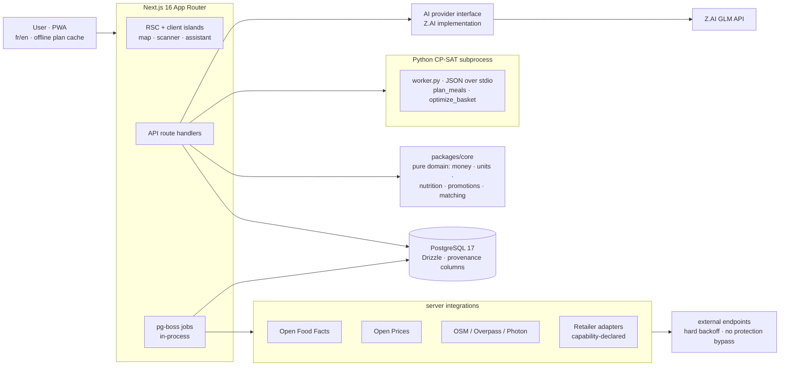

# Maqrivo


**Grocery optimization with verifiable price provenance.** Given what you want to eat, your nutrition targets, your budget, your pantry and current supermarket prices — Maqrivo plans the week's meals and computes the exact basket to buy. A CP-SAT solver does the deciding; every price it decides with carries its evidence (store, quantity, date observed, source, validity).

[](LICENSE)


## Why this exists

Every meal planner on the market invents its numbers: fictional prices, fictional macros. I wanted the opposite loop — optimize what to actually **buy** from live prices and promotions, and never print a number the system can't prove. That principle ("no evidence, no deal") shaped the whole architecture: provenance is a first-class column, missing data beats fabricated data, and the AI proposes while deterministic code verifies.

## Status

First complete vertical slice, live and self-hosted (M0–M11): French/English shell, auth, store discovery (Overpass + supermarche.com + Carrefour eligibility API), custom stores, Open Food Facts barcode import, manual + Open Prices observations with freshness, promotions with provenance and expiry, recipes with deterministic nutrition, pantry, CP-SAT meal planning and basket optimization (OPTIMAL end-to-end), Z.AI recipe generation — the model proposes, Maqrivo verifies the macros deterministically (a generated "Curry de poulet au yaourt grec" passed at 786 kcal / 78 g protein per serving) — and a tool-using assistant. 158 automated tests green (113 core, 22 web, 19 solver, 4 e2e).

## Screenshots

| | |
|---|---|
|  |  |
| Store discovery (OpenStreetMap + retailer directories) | Recipe with deterministic nutrition |
|  |  |
| Solver output — the basket to buy, grouped by store, with the recommended route | Offers with provenance and expiry |

## Quickstart

```bash
pnpm install
cp .env.example .env            # set SIGNUP_INVITE_CODE, BETTER_AUTH_SECRET
cp .env apps/web/.env.local     # Next only loads env from apps/web/
pnpm dev:deps                   # postgres 17 via docker compose
pnpm db:migrate
pnpm --filter @maqrivo/db seed:global   # retailers + food concepts
pnpm db:seed                    # optional dev data: dev user, recipes, weekly plan
pnpm dev                        # http://localhost:3000  (/fr default, /en available)
```

Seeded demo login: `dev@maqrivo.local` / `dev-password-123`. The solver needs Python ≥3.11 with OR-Tools — `cd solver && uv sync` creates the venv the app auto-detects.

Gates: `pnpm lint` · `pnpm typecheck` · `pnpm test` · `pnpm solver:test` (Python ≥3.11, installs OR-Tools) · `pnpm test:e2e` (Playwright)

Production: `docker compose -f compose.prod.yaml up -d --build` (single app container + Postgres; `POSTGRES_PASSWORD` required from env).

## Architecture

Modular monolith: one Next.js app serves UI, API and in-process pg-boss jobs; the deterministic solver is a Python subprocess speaking a versioned JSON-over-stdio contract; one Postgres holds everything. No Redis, no broker, no microservices.



Full detail: [`docs/architecture.md`](docs/architecture.md) — plus [data sources](docs/data_sources.md), [domain model](docs/domain_model.md), [CP-SAT optimization](docs/optimization.md), [retailer adapters](docs/retailer_adapters.md), [AI boundaries](docs/ai.md), [deployment](docs/deployment.md), and the [ADRs](docs/adr/).

## What I'd do differently

1. **Warm the solver earlier.** Each solve spawns a fresh Python subprocess — trivially testable and fine for a household, but the ~1–2 s cold start would need a warm worker pool the day there are concurrent users.
2. **Lead with the observation UX, not the integrations.** Retailer APIs were mostly dead ends; crowd coverage (Open Prices) plus fast manual entry turned out to be the real data engine. I'd build that loop first and let adapters accrete slowly behind it.
3. **Separate the job runner sooner.** pg-boss inside the web process means a deploy restarts in-flight ingestion. Cheap fix later, but it's a deliberate coupling I'd revisit.

## Author

**Youssef Ouhaghi Ahmian** — [mokka-agentur.de](https://mokka-agentur.de) · [GitHub](https://github.com/Gjusev)

MIT License — see [LICENSE](LICENSE).
