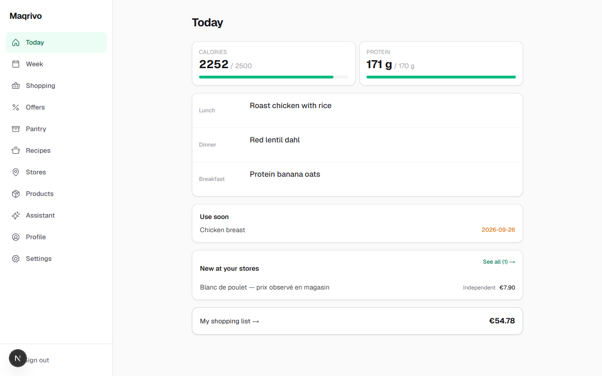
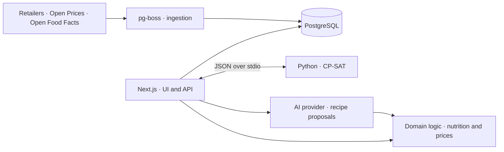
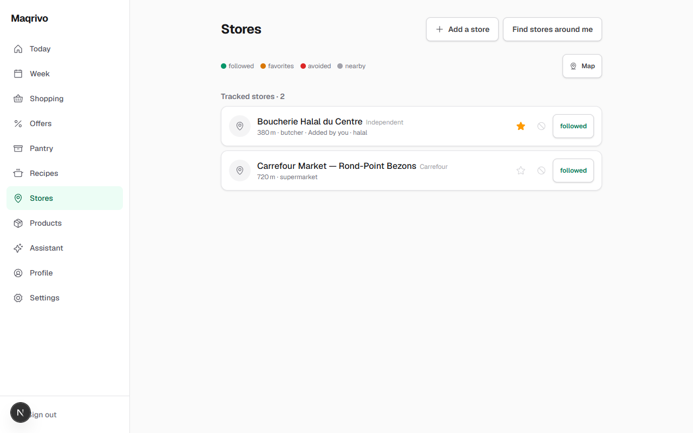
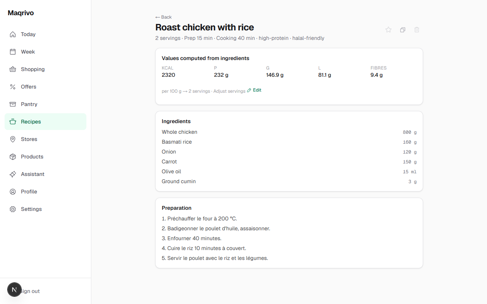
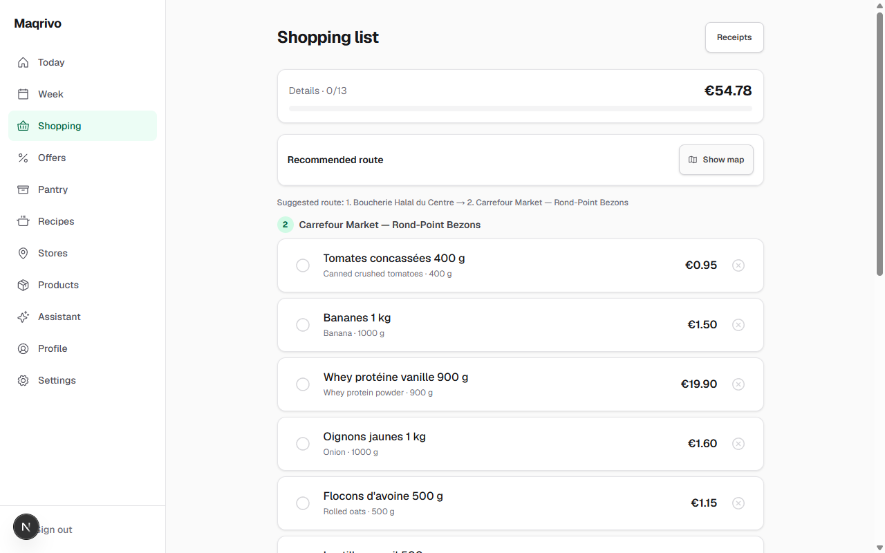
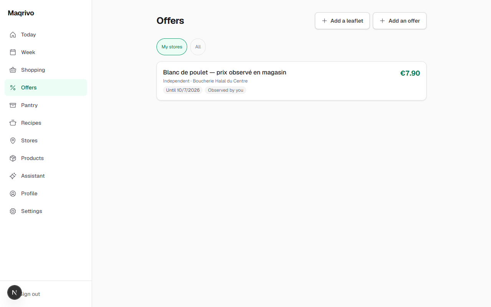

<h1 align="center">Maqrivo</h1>
<p align="center"><strong>Meal planning meets grocery optimization.</strong></p>
<p align="center">
  <a href="LICENSE"></a>
  
  
  
</p>
<p align="center">
  <a href="#quickstart">Quickstart</a> · <a href="#architecture">Architecture</a> · <a href="#screenshots">Screenshots</a> · <a href="docs/README.md">Documentation</a>
</p>



A self-hosted meal planner that turns nutrition targets, pantry stock and observed supermarket prices into a weekly plan and a shopping basket. **AI proposes recipes. Deterministic code computes nutrition. CP-SAT chooses the plan.**

## Why this exists

A cheap meal plan is only useful when its prices correspond to something you can buy. I built Maqrivo around price provenance: source, store, quantity, observation date and promotion validity travel with the data.

| Plan | Verify | Buy |
| :--- | :--- | :--- |
| Meals constrained by nutrition, budget and pantry | Recipe macros calculated from ingredient data | A basket grouped by store, with price evidence |
| Python + OR-Tools CP-SAT | Pure TypeScript domain functions | Observations, promotions and retailer adapters |

**Status:** working product under active development. English and French UI. Coverage depends on available price observations; missing data is not replaced with invented prices. Screenshots show seeded demonstration data.

## Quickstart

Requires Node.js 22+, pnpm 11, Docker, and Python 3.11+ with `uv` for the solver.

```bash
git clone https://github.com/Gjusev/maqrivo.git
cd maqrivo
pnpm install --frozen-lockfile
cp .env.example .env
# Set SIGNUP_INVITE_CODE and a random BETTER_AUTH_SECRET in .env.
cp .env apps/web/.env.local
uv sync --directory solver
pnpm dev:deps
pnpm db:migrate
pnpm --filter @maqrivo/db seed:global
pnpm db:seed
pnpm dev
```

Open [localhost:3000/en](http://localhost:3000/en). The optional development seed creates `dev@maqrivo.local` / `dev-password-123`. Keep the two environment files in sync when changing configuration. On PowerShell, use `Copy-Item` in place of `cp`.

AI features require a configured provider key. [Setup, checks and deployment →](docs/getting-started.md)

## Architecture



One application, one database, one solver subprocess. Price ingestion uses Postgres-backed jobs; the solver receives a versioned input document and has no database access. [Architecture and boundaries →](docs/architecture.md)

## Screenshots

| Store discovery | Recipe nutrition |
| :---: | :---: |
|  |  |
| Store locations and available sources | Calculated macros per serving |

<details>
<summary><strong>View the shopping basket and offers</strong></summary>

| Shopping basket | Offers |
| :---: | :---: |
|  |  |

</details>

## Engineering decisions

| Decision | Benefit | Cost |
| :--- | :--- | :--- |
| Integer cents and explicit units | Repeatable price and nutrition calculations | More normalization at ingestion |
| CP-SAT behind a JSON contract | Solver can be tested independently | Process startup and timeout handling |
| Postgres-backed jobs | One datastore to operate | Jobs share the web process lifecycle |
| AI outputs treated as proposals | Model output does not become trusted nutrition data | Validation and repair are required |

## What I'd do differently

- **Start with price entry and coverage.** A reliable observation workflow matters more than the number of retailer integrations.
- **Warm the solver when concurrency warrants it.** A subprocess is simple to isolate; a pool would avoid repeated startup work.
- **Separate the job runner before scaling ingestion.** Deploying the web application currently interrupts the same process that runs jobs.

[Documentation index](docs/README.md) · [Optimization](docs/optimization.md) · [AI boundaries](docs/ai.md) · [Decision records](docs/adr/)

---

Built by **Youssef Ouhaghi Ahmian** · [Mokka](https://mokka-agentur.de) · [GitHub](https://github.com/Gjusev)  
Released under the [MIT license](LICENSE).
